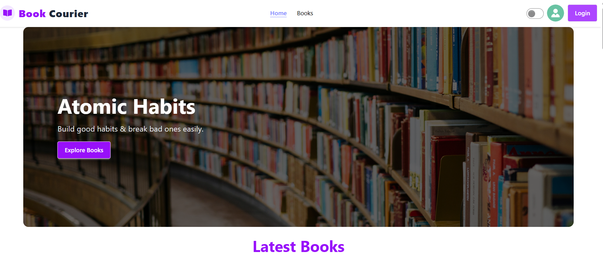

# 📚 Book Courier

A full‑stack **Book Delivery & Management Platform** where users can browse books, place orders, manage payments, and librarians/admins can manage books and orders. The project is built with a modern, responsive UI and role‑based dashboards.

---

## 🔗 Live Links

* **Client:** (Add your live site link here)
* **Server:** (Add your server link here)

---

## 📸 Project Screenshots

> 

## 🧩 Project Features Overview

### 🌐 Layout & Page Structure

* **Navbar**

  * Logo + Website Name
  * Navigation Links: Home, Books, Dashboard, Login/Register
  * User profile image shown when logged in
  * Mobile‑responsive hamburger menu
  * Light/Dark theme toggle

* **Footer**

  * Quick links
  * Contact details
  * Social media icons (including new **X** logo)
  * Copyright notice

* **Main Layout**

  * Navbar at the top
  * Footer at the bottom
  * Dynamic main content in between

* **Dashboard Layout**

  * Sidebar + main content section
  * Role‑based dashboard (User / Librarian / Admin)
  * Collapsible sidebar (optional)
  * Fully responsive for mobile, tablet & desktop

---

## 🔐 Authentication System

### Login

* Email & Password authentication
* One social login (Google)
* Email verification not required

### Registration

* Fields: Name, Email, Password, Profile Image
* Profile picture updates immediately after registration
* Strong password validation
* Image upload supported (file input)

---

## 🏠 Home Page Sections

* **Banner / Slider**

  * Minimum 3 sliders
  * Each slide contains book image, title, short description & link to All Books page

* **Latest Books**

  * Shows last 4–6 books added by librarians

* **Coverage Section**

  * Interactive map showing delivery coverage areas

* **Why Choose Book Courier**

  * Highlights benefits of using Book Courier

* **Animations & Extra Sections**

  * At least 1 animated section
  * 2 additional well‑designed sections

---

## 📖 All Books Page

* Displays all **published** books
* Card‑based layout with equal height & width
* Search books by name
* Sort books by price
* Clicking a card opens the Book Details page

---

## 📘 Book Details Page

* Shows full book information
* **Order Now** button
* Order Modal Fields:

  * Name (readonly)
  * Email (readonly)
  * Phone Number
  * Address
* On placing order:

  * Order saved to database
  * Modal closes automatically
  * Order status: `pending`
  * Payment status: `unpaid`

---

## 👤 User Dashboard

### My Orders

* Table view of ordered books

* Shows:

  * Book Title
  * Order Date
  * Status
  * Action buttons

* **Cancel Order**

  * Available only if status is `pending`

* **Pay Now**

  * Visible only for unpaid orders
  * Redirects to payment page
  * After payment:

    * Payment status becomes `paid`
    * Pay button hidden

* Cancelled orders hide all action buttons

### My Profile

* View logged‑in user profile
* Update name and profile image

### My Wishlist (Challenge Feature)

* Add books to wishlist from Book Details page
* View all wishlisted books

### Invoices

* Shows all completed payments
* Includes:

  * Payment ID
  * Amount
  * Date
  * (Optional) Book Name

---

## 📚 Librarian Dashboard

### Add Book

* Form fields:

  * Book Name
  * Image
  * Author
  * Status (Published / Unpublished)
  * Price
* Unpublished books are hidden from All Books page

### My Books

* Table showing all books added by the librarian
* Edit option available
* Books cannot be deleted, only unpublished

### Orders

* View orders for librarian’s books
* Can cancel orders
* Update order status:

  * `pending → shipped → delivered`

---

## 🛠️ Admin Dashboard

### All Users

* View all registered users
* Assign roles:

  * Make Librarian
  * Make Admin

### Manage Books

* View all books from all librarians
* Publish / Unpublish books
* Delete books (also deletes related orders)

### My Profile

* Same functionality as User Profile

## 📊 Dashboard UI Features

* Full‑width layout
* Consistent color theme
* Responsive sidebar
* Charts & graphs for data visualization
* User profile section

---

## 🚀 Challenge Features Implemented

* ✅ Book Wishlist
* ✅ Search & Sort (by name & price)
* ✅ JWT Authentication using Firebase token verification

---

## 🔌 API Endpoints

> **Base URL:** `https://book-curier-server.vercel.app`
## 🧰 Tech Stack
### Frontend

* React
* React Router
* Tailwind CSS
* Firebase Authentication
* React Query
* Axios

### Backend

* Node.js
* Express.js
* MongoDB
* JWT Authentication

---

## 📌 Resources Used
* [https://uiverse.io/](https://uiverse.io/)
* [https://devmeetsdevs.com/](https://devmeetsdevs.com/)
* [https://bootcamp.uxdesign.cc/](https://bootcamp.uxdesign.cc/)
* [https://themeforest.net/](https://themeforest.net/)
* [https://codecanyon.net/](https://codecanyon.net/)

---

## 👨‍💻 Author

**Md Saifur Rahman**

---

> ✨ *Book Courier is designed to provide a seamless online book ordering and delivery experience with role‑based dashboards and a modern UI.*

Project Update on going..